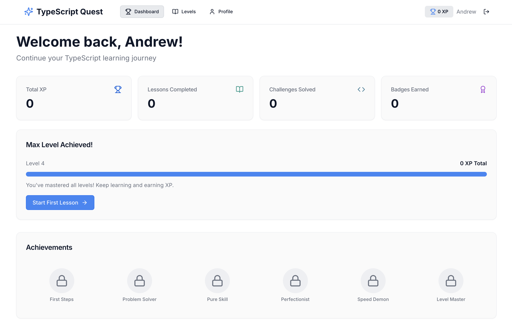
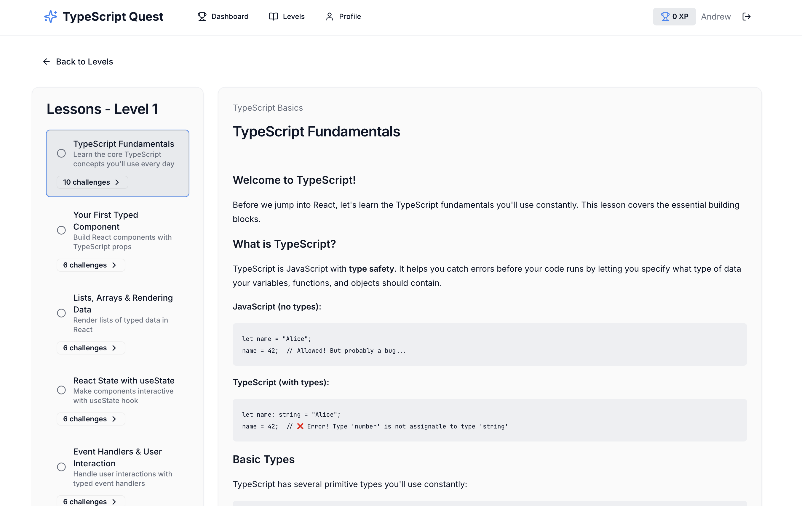

# TypeScript Quest

> A gamified learning platform to master TypeScript with React through interactive challenges and hands-on practice.

**[Live Demo](https://typescriptquest.com)**

<!-- Add screenshot: save image to docs/screenshot.png then uncomment below -->

## Features

- **Gamified Learning** - Earn XP, level up, and unlock new content as you progress
- **Interactive Code Challenges** - Write real TypeScript in a browser-based editor with instant validation
- **Multiple-Choice Quizzes** - Test your knowledge with immediate feedback
- **Progress Tracking** - Dashboard showing your stats, completed lessons, and achievements
- **Badge System** - Earn badges for milestones and accomplishments
- **Premium Content** - Subscription-based access to advanced levels

## Tech Stack

**Frontend**
- React 18 with TypeScript
- Vite for build tooling
- Tailwind CSS + shadcn/ui components
- TanStack Query for data fetching
- Wouter for routing

**Backend**
- Node.js + Express
- PostgreSQL with Drizzle ORM
- Session-based authentication
- OAuth integration (GitHub, Google)

**Infrastructure**
- Netlify (frontend)
- AWS Elastic Beanstalk (backend)
- Neon serverless PostgreSQL
- Stripe for payments
